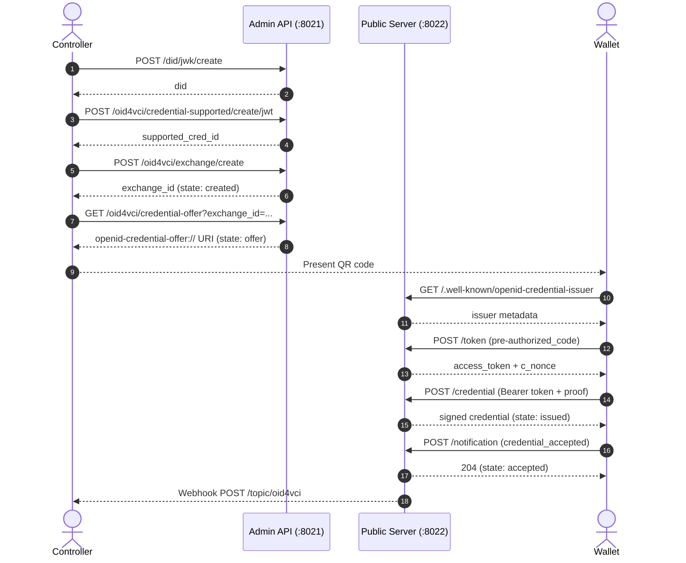

# Issuance Cookbook

This guide walks through the complete credential issuance flow for each supported format using step-by-step `curl` commands.

**Base URLs used in examples:**

```bash
ADMIN="http://localhost:8021"   # ACA-Py admin API
PUBLIC="http://localhost:8022"  # OID4VCI public server
```

---

## Overview: The Pre-Authorized Code Flow



---

## jwt_vc_json

W3C Verifiable Credentials in JWT format. The issued credential is a JWT with the `vc` claim following the W3C VCDM v1 structure.

### Step 1: Create a DID

```bash
DID=$(curl -s -X POST $ADMIN/did/jwk/create \
  -H "Content-Type: application/json" \
  -d '{"key_type": "p256"}' | python3 -c "import json,sys; print(json.load(sys.stdin)['did'])")
echo "DID: $DID"
```

### Step 2: Create a Supported Credential Record

```bash
SUPP_ID=$(curl -s -X POST $ADMIN/oid4vci/credential-supported/create/jwt \
  -H "Content-Type: application/json" \
  -d "{
    \"format\": \"jwt_vc_json\",
    \"id\": \"UniversityDegreeCredential\",
    \"type\": [\"VerifiableCredential\", \"UniversityDegreeCredential\"],
    \"@context\": [\"https://www.w3.org/2018/credentials/v1\"],
    \"cryptographic_binding_methods_supported\": [\"did:jwk\"],
    \"proof_types_supported\": {
      \"jwt\": {\"proof_signing_alg_values_supported\": [\"ES256\", \"EdDSA\"]}
    },
    \"display\": [{\"name\": \"University Degree\", \"locale\": \"en-US\"}],
    \"credentialSubject\": {
      \"given_name\": {\"display\": [{\"name\": \"Given Name\", \"locale\": \"en-US\"}]},
      \"family_name\": {\"display\": [{\"name\": \"Family Name\", \"locale\": \"en-US\"}]},
      \"degree\": {\"display\": [{\"name\": \"Degree\", \"locale\": \"en-US\"}]}
    }
  }" | python3 -c "import json,sys; print(json.load(sys.stdin)['supported_cred_id'])")
echo "Supported credential ID: $SUPP_ID"
```

### Step 3: Create an Exchange Record

```bash
EXCHANGE=$(curl -s -X POST $ADMIN/oid4vci/exchange/create \
  -H "Content-Type: application/json" \
  -d "{
    \"supported_cred_id\": \"$SUPP_ID\",
    \"did\": \"$DID\",
    \"credential_subject\": {
      \"given_name\": \"Alice\",
      \"family_name\": \"Smith\",
      \"degree\": \"Bachelor of Science in Computer Science\"
    }
  }")
EXCHANGE_ID=$(echo $EXCHANGE | python3 -c "import json,sys; print(json.load(sys.stdin)['exchange_id'])")
echo "Exchange ID: $EXCHANGE_ID"
```

### Step 4: Generate a Credential Offer

```bash
OFFER=$(curl -s "$ADMIN/oid4vci/credential-offer?exchange_id=$EXCHANGE_ID")
OFFER_URI=$(echo $OFFER | python3 -c "import json,sys; print(json.load(sys.stdin)['credential_offer'])")
echo "Offer URI (show as QR code): $OFFER_URI"
```

The `OFFER_URI` looks like:

```
openid-credential-offer://?credential_offer=%7B%22credential_issuer%22%3A%22...
```

Display this as a QR code for the wallet to scan, or deep-link to the wallet app.

### Step 5: Check Exchange State

```bash
curl -s "$ADMIN/oid4vci/exchange/records/$EXCHANGE_ID" | python3 -c \
  "import json,sys; r=json.load(sys.stdin); print('State:', r['state'])"
```

Expected progression: `created` → `offer` → `issued` → `accepted`

### Wallet-Side Steps (for reference)

The wallet performs these steps automatically:

```bash
# 1. Retrieve issuer metadata
curl -s "$PUBLIC/.well-known/openid-credential-issuer"

# 2. Extract pre-authorized code from offer and request token
PRE_AUTH_CODE="SplxlOBeZQQYbYS6WxSbIA"
curl -X POST "$PUBLIC/token" \
  --data-urlencode "grant_type=urn:ietf:params:oauth:grant-type:pre-authorized_code" \
  --data-urlencode "pre-authorized_code=$PRE_AUTH_CODE"

# 3. Request credential (wallet builds proof JWT internally)
curl -X POST "$PUBLIC/credential" \
  -H "Authorization: Bearer <access_token>" \
  -H "Content-Type: application/json" \
  -d '{ "credential_identifier": "UniversityDegreeCredential", "proof": { "proof_type": "jwt", "jwt": "<proof-jwt>" } }'
```

---

## sd_jwt_vc

SD-JWT Verifiable Credentials with selective disclosure. Requires `--plugin sd_jwt_vc` to be loaded.

### Step 1: Create a DID

Same as above. Use `p256` or `ed25519` key type.

### Step 2: Create a Supported Credential Record

```bash
SUPP_ID=$(curl -s -X POST $ADMIN/oid4vci/credential-supported/create/sd-jwt \
  -H "Content-Type: application/json" \
  -d '{
    "format": "vc+sd-jwt",
    "id": "EmployeeCredential",
    "vct": "EmployeeCredential",
    "cryptographic_binding_methods_supported": ["did:jwk", "jwk"],
    "display": [{"name": "Employee Credential", "locale": "en-US"}],
    "claims": {
      "given_name": {"display": [{"name": "Given Name", "locale": "en-US"}]},
      "family_name": {"display": [{"name": "Family Name", "locale": "en-US"}]},
      "department": {"display": [{"name": "Department", "locale": "en-US"}]},
      "employee_id": {"display": [{"name": "Employee ID", "locale": "en-US"}]}
    },
    "sd_list": ["/given_name", "/family_name", "/department"]
  }' | python3 -c "import json,sys; print(json.load(sys.stdin)['supported_cred_id'])")
echo "Supported credential ID: $SUPP_ID"
```

> **About `sd_list`:** Claims listed in `sd_list` (as JSON Pointer paths) will be selectively disclosable. The wallet holder can choose to reveal only a subset. Claims *not* in `sd_list` are always included in the credential.
>
> Protected claims that can never be in `sd_list`: `/iss`, `/exp`, `/vct`, `/nbf`, `/cnf`, `/status`.

### Step 3: Create an Exchange Record

```bash
EXCHANGE=$(curl -s -X POST $ADMIN/oid4vci/exchange/create \
  -H "Content-Type: application/json" \
  -d "{
    \"supported_cred_id\": \"$SUPP_ID\",
    \"did\": \"$DID\",
    \"credential_subject\": {
      \"given_name\": \"Alice\",
      \"family_name\": \"Smith\",
      \"department\": \"Engineering\",
      \"employee_id\": \"EMP-12345\"
    }
  }")
EXCHANGE_ID=$(echo $EXCHANGE | python3 -c "import json,sys; print(json.load(sys.stdin)['exchange_id'])")
```

### Step 4: Generate a Credential Offer

```bash
OFFER_URI=$(curl -s "$ADMIN/oid4vci/credential-offer?exchange_id=$EXCHANGE_ID" | \
  python3 -c "import json,sys; print(json.load(sys.stdin)['credential_offer'])")
echo "Offer URI: $OFFER_URI"
```

### Issued Credential Structure

The issued SD-JWT has the form:

```
<header>.<payload>.<signature>~<disclosure1>~<disclosure2>~...~<kb-jwt>
```

The payload contains:
- `vct`: `"EmployeeCredential"` (always disclosed)
- `iss`: issuer DID (always disclosed)
- `employee_id`: `"EMP-12345"` (always disclosed — not in `sd_list`)
- Selective disclosures for `given_name`, `family_name`, `department` as `_sd` hashes

---

## mso_mdoc

ISO 18013-5 mobile Documents (mDOC) in CBOR/COSE format. Requires `--plugin mso_mdoc` to be loaded and the `isomdl-uniffi` native library to be installed.

### Initial Setup: Verify Keys Exist

On first startup, the `mso_mdoc` plugin auto-generates a default signing key and self-signed certificate. Confirm they exist:

```bash
curl -s $ADMIN/mso_mdoc/certificates/default | python3 -m json.tool
```

To generate additional keys (e.g. for key rotation):

```bash
curl -X POST $ADMIN/mso_mdoc/generate-keys | python3 -m json.tool
```

### Step 1: Create a Supported Credential Record

For mDOC, use the generic `POST /oid4vci/credential-supported/create` endpoint:

```bash
SUPP_ID=$(curl -s -X POST $ADMIN/oid4vci/credential-supported/create \
  -H "Content-Type: application/json" \
  -d '{
    "format": "mso_mdoc",
    "id": "org.iso.18013.5.1.mDL",
    "cryptographic_binding_methods_supported": ["cose_key"],
    "proof_types_supported": {
      "jwt": {"proof_signing_alg_values_supported": ["ES256"]}
    },
    "display": [{"name": "Mobile Driving Licence", "locale": "en-US"}],
    "format_data": {
      "doctype": "org.iso.18013.5.1.mDL"
    }
  }' | python3 -c "import json,sys; print(json.load(sys.stdin)['supported_cred_id'])")
echo "Supported credential ID: $SUPP_ID"
```

### Step 2: Create an Exchange Record

For mDOC, `credential_subject` is organized by **namespace**:

```bash
EXCHANGE=$(curl -s -X POST $ADMIN/oid4vci/exchange/create \
  -H "Content-Type: application/json" \
  -d "{
    \"supported_cred_id\": \"$SUPP_ID\",
    \"credential_subject\": {
      \"org.iso.18013.5.1\": {
        \"given_name\": \"Alice\",
        \"family_name\": \"Smith\",
        \"birth_date\": \"1990-01-15\",
        \"document_number\": \"DL-1234567890\",
        \"expiry_date\": \"2030-01-01\",
        \"issuing_country\": \"US\",
        \"driving_privileges\": [
          {\"vehicle_category_code\": \"B\", \"issue_date\": \"2020-01-01\"}
        ]
      }
    }
  }")
EXCHANGE_ID=$(echo $EXCHANGE | python3 -c "import json,sys; print(json.load(sys.stdin)['exchange_id'])")
```

### Step 3: Generate a Credential Offer

```bash
OFFER_URI=$(curl -s "$ADMIN/oid4vci/credential-offer?exchange_id=$EXCHANGE_ID" | \
  python3 -c "import json,sys; print(json.load(sys.stdin)['credential_offer'])")
echo "Offer URI: $OFFER_URI"
```

### Issued Credential Structure

The issued mDOC is a CBOR-encoded device response following ISO 18013-5. The credential is base64url-encoded in the response.

---

## PIN-Protected Issuance

To require the holder to enter a PIN (transaction code) at token time, set the `pin` field when creating the exchange:

```bash
EXCHANGE=$(curl -s -X POST $ADMIN/oid4vci/exchange/create \
  -H "Content-Type: application/json" \
  -d "{
    \"supported_cred_id\": \"$SUPP_ID\",
    \"credential_subject\": { ... },
    \"pin\": \"493536\"
  }")
```

Then generate the offer with `user_pin_required=true`:

```bash
OFFER_URI=$(curl -s "$ADMIN/oid4vci/credential-offer?exchange_id=$EXCHANGE_ID&user_pin_required=true" | \
  python3 -c "import json,sys; print(json.load(sys.stdin)['credential_offer'])")
```

Deliver the PIN to the holder via a separate channel (email, SMS, etc.). The wallet must include `tx_code=493536` in the token request.

---

## Credential Refresh

When a credential expires or needs to be refreshed, use the `refresh_id` from the original exchange record:

```bash
# Get the refresh_id from the original exchange
REFRESH_ID=$(curl -s $ADMIN/oid4vci/exchange/records/$EXCHANGE_ID | \
  python3 -c "import json,sys; print(json.load(sys.stdin).get('refresh_id', 'N/A'))")

# Create a new exchange superseding the original
NEW_EXCHANGE=$(curl -s -X PATCH "$ADMIN/oid4vci/credential-refresh/$REFRESH_ID")
NEW_EXCHANGE_ID=$(echo $NEW_EXCHANGE | python3 -c "import json,sys; print(json.load(sys.stdin)['exchange_id'])")

# Generate new offer for the refreshed credential
OFFER_URI=$(curl -s "$ADMIN/oid4vci/credential-offer?exchange_id=$NEW_EXCHANGE_ID" | \
  python3 -c "import json,sys; print(json.load(sys.stdin)['credential_offer'])")
```

The original exchange state becomes `superceded`.

---

## Status List Integration

When the Status List Plugin is configured (`OID4VCI_STATUS_HANDLER=status_list.v1_0.status_handler`), bind a status list definition to a supported credential ID. All credentials issued with that `supported_cred_id` will include a `credentialStatus` entry:

```bash
# Bind the status list to a supported credential (via Status List Plugin API)
curl -X POST $ADMIN/status-list/defs \
  -H "Content-Type: application/json" \
  -d "{
    \"issuer_did\": \"$DID\",
    \"list_type\": \"ietf\",
    \"list_size\": 131072,
    \"shard_size\": 1024,
    \"status_purpose\": \"revocation\",
    \"supported_cred_id\": \"$SUPP_ID\",
    \"verification_method\": \"${DID}#0\"
  }"
```

---

## Webhook Events

Subscribe to the `oid4vci` topic to monitor exchange state changes:

```bash
# ACA-Py webhook payload example:
{
  "topic": "oid4vci",
  "wallet_id": "...",
  "payload": {
    "exchange_id": "abc123-...",
    "state": "issued",
    "supported_cred_id": "...",
    ...
  }
}
```

Exchange states in order:

| State | Trigger |
|---|---|
| `created` | `POST /oid4vci/exchange/create` |
| `offer` | `GET /oid4vci/credential-offer` (offer generated) |
| `issued` | Wallet successfully called `POST /credential` |
| `accepted` | Wallet called `POST /notification` with `credential_accepted` |
| `failed` | Error during issuance |
| `deleted` | Exchange record deleted via API |
| `superceded` | Exchange replaced by a refresh |
