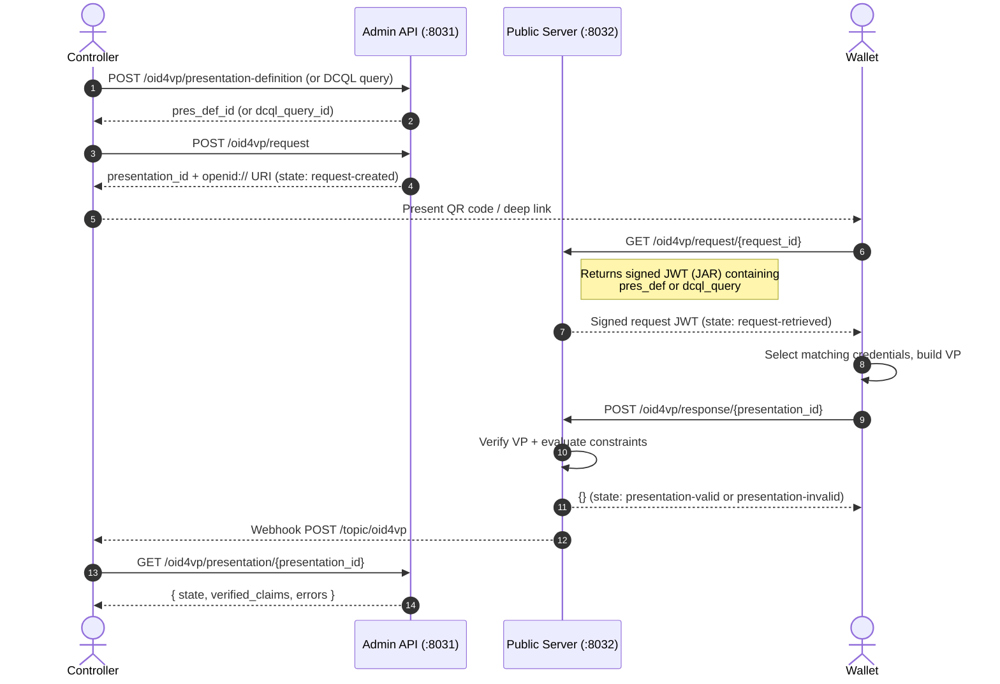

# Verification Cookbook

This guide walks through the complete credential presentation (VP) verification flow using both PEX (Presentation Exchange) and DCQL (Digital Credentials Query Language) query methods.

**Base URLs used in examples:**

```bash
ADMIN="http://localhost:8031"   # ACA-Py verifier admin API
PUBLIC="http://localhost:8032"  # OID4VP public server
```

---

## Overview: The OID4VP direct_post Flow



---

## PEX — Presentation Definition

Use PEX (Presentation Exchange v2) for flexible credential queries with constraint filters for any credential format.

### Step 1: Create a Presentation Definition

#### Example: Request a JWT VC University Degree

```bash
PRES_DEF_ID=$(curl -s -X POST $ADMIN/oid4vp/presentation-definition \
  -H "Content-Type: application/json" \
  -d '{
    "pres_def": {
      "id": "university-degree-request",
      "input_descriptors": [
        {
          "id": "degree",
          "format": {
            "jwt_vc_json": {"alg": ["ES256", "EdDSA"]}
          },
          "constraints": {
            "fields": [
              {
                "path": ["$.vc.type"],
                "filter": {
                  "type": "array",
                  "contains": {"const": "UniversityDegreeCredential"}
                }
              },
              {
                "path": ["$.vc.credentialSubject.degree"],
                "filter": {"type": "string"}
              }
            ]
          }
        }
      ]
    }
  }' | python3 -c "import json,sys; print(json.load(sys.stdin)['pres_def_id'])")
echo "Presentation definition ID: $PRES_DEF_ID"
```

#### Example: Request an SD-JWT Employee Credential

```bash
PRES_DEF_ID=$(curl -s -X POST $ADMIN/oid4vp/presentation-definition \
  -H "Content-Type: application/json" \
  -d '{
    "pres_def": {
      "id": "employee-credential-request",
      "input_descriptors": [
        {
          "id": "employee",
          "format": {
            "vc+sd-jwt": {"alg": ["ES256"]}
          },
          "constraints": {
            "limit_disclosure": "required",
            "fields": [
              {
                "path": ["$.vct"],
                "filter": {"type": "string", "const": "EmployeeCredential"}
              },
              {
                "path": ["$.given_name"],
                "filter": {"type": "string"}
              },
              {
                "path": ["$.department"],
                "filter": {"type": "string"}
              }
            ]
          }
        }
      ]
    }
  }' | python3 -c "import json,sys; print(json.load(sys.stdin)['pres_def_id'])")
```

### Step 2: Create a VP Request

```bash
RESPONSE=$(curl -s -X POST $ADMIN/oid4vp/request \
  -H "Content-Type: application/json" \
  -d "{
    \"pres_def_id\": \"$PRES_DEF_ID\",
    \"vp_formats\": {
      \"jwt_vc_json\": {\"alg\": [\"ES256\", \"EdDSA\"]},
      \"jwt_vp_json\": {\"alg\": [\"ES256\", \"EdDSA\"]}
    }
  }")
REQUEST_URI=$(echo $RESPONSE | python3 -c "import json,sys; print(json.load(sys.stdin)['request_uri'])")
PRES_ID=$(echo $RESPONSE | python3 -c "import json,sys; print(json.load(sys.stdin)['presentation']['presentation_id'])")
echo "Request URI (show as QR code): $REQUEST_URI"
echo "Presentation ID (poll for result): $PRES_ID"
```

The `REQUEST_URI` looks like:

```
openid://?client_id=did:jwk:...&request_uri=https://verifier.example.com/oid4vp/request/abc123
```

### Step 3: Poll for Result

```bash
while true; do
  RESULT=$(curl -s "$ADMIN/oid4vp/presentation/$PRES_ID")
  STATE=$(echo $RESULT | python3 -c "import json,sys; print(json.load(sys.stdin)['state'])")
  echo "State: $STATE"
  if [[ "$STATE" == "presentation-valid" ]]; then
    echo "Verified claims:"
    echo $RESULT | python3 -c "import json,sys; print(json.dumps(json.load(sys.stdin).get('verified_claims', {}), indent=2))"
    break
  elif [[ "$STATE" == "presentation-invalid" ]]; then
    echo "Errors:"
    echo $RESULT | python3 -c "import json,sys; print(json.load(sys.stdin).get('errors', []))"
    break
  fi
  sleep 2
done
```

**Example successful response:**

```json
{
  "presentation_id": "def456-...",
  "state": "presentation-valid",
  "errors": [],
  "verified_claims": {
    "degree": {
      "given_name": "Alice",
      "degree": "Bachelor of Science in Computer Science"
    }
  }
}
```

---

## DCQL Queries

DCQL (Digital Credentials Query Language) is better suited for mDOC and SD-JWT queries where you want to match on `doctype` or `vct` values and specify individual claim paths directly.

### DCQL vs PEX

| Feature | PEX | DCQL |
|---|---|---|
| Constraint language | JSONPath with filter schemas | Claim-level path matching |
| Presentation submission | Required (descriptor map) | Not required |
| `vp_token` format | JWT VP (for JWT formats) | JSON object keyed by query `id` |
| mDOC support | Limited | Native (namespace + claim_name) |
| SD-JWT support | Via `limit_disclosure: required` | Via `path` + `vct_values` |

### DCQL — mDOC Driver's License

#### Step 1: Create a DCQL Query

```bash
DCQL_ID=$(curl -s -X POST $ADMIN/oid4vp/dcql/queries \
  -H "Content-Type: application/json" \
  -d '{
    "credentials": [
      {
        "id": "mdl",
        "format": "mso_mdoc",
        "meta": {
          "doctype_value": "org.iso.18013.5.1.mDL"
        },
        "claims": [
          {
            "namespace": "org.iso.18013.5.1",
            "claim_name": "given_name"
          },
          {
            "namespace": "org.iso.18013.5.1",
            "claim_name": "family_name"
          },
          {
            "namespace": "org.iso.18013.5.1",
            "claim_name": "birth_date"
          },
          {
            "namespace": "org.iso.18013.5.1",
            "claim_name": "document_number"
          }
        ]
      }
    ]
  }' | python3 -c "import json,sys; r=json.load(sys.stdin); print(list(r.get('results',[r]))[0].get('dcql_query_id','') if 'results' in r else '')" 2>/dev/null)

# Alternatively, list to find the ID:
DCQL_ID=$(curl -s $ADMIN/oid4vp/dcql/queries | python3 -c \
  "import json,sys; results=json.load(sys.stdin)['results']; print(results[-1]['dcql_query_id'])")
echo "DCQL query ID: $DCQL_ID"
```

#### Step 2: Create a VP Request

```bash
RESPONSE=$(curl -s -X POST $ADMIN/oid4vp/request \
  -H "Content-Type: application/json" \
  -d "{
    \"dcql_query_id\": \"$DCQL_ID\",
    \"vp_formats\": {
      \"mso_mdoc\": {\"alg\": [\"ES256\"]}
    }
  }")
REQUEST_URI=$(echo $RESPONSE | python3 -c "import json,sys; print(json.load(sys.stdin)['request_uri'])")
PRES_ID=$(echo $RESPONSE | python3 -c "import json,sys; print(json.load(sys.stdin)['presentation']['presentation_id'])")
echo "Request URI: $REQUEST_URI"
echo "Presentation ID: $PRES_ID"
```

The signed JAR returned by the wallet fetch endpoint (`GET /oid4vp/request/{request_id}`) contains:

```json
{
  "dcql_query": {
    "credentials": [
      {
        "id": "mdl",
        "format": "mso_mdoc",
        "meta": {"doctype_value": "org.iso.18013.5.1.mDL"},
        "claims": [...]
      }
    ]
  },
  "response_uri": "https://verifier.example.com/oid4vp/response/def456",
  "nonce": "...",
  "client_id": "did:jwk:..."
}
```

The wallet's DCQL `vp_token` response is a **JSON object** keyed by credential query `id`:

```json
{
  "mdl": "<cbor-hex-encoded-device-response>"
}
```

#### Step 3: Poll for Result

Same as PEX:

```bash
curl -s "$ADMIN/oid4vp/presentation/$PRES_ID" | python3 -c \
  "import json,sys; r=json.load(sys.stdin); print('State:', r['state'])"
```

---

### DCQL — SD-JWT Employee Credential

```bash
DCQL_ID=$(curl -s -X POST $ADMIN/oid4vp/dcql/queries \
  -H "Content-Type: application/json" \
  -d '{
    "credentials": [
      {
        "id": "employee",
        "format": "vc+sd-jwt",
        "meta": {
          "vct_values": ["EmployeeCredential"]
        },
        "claims": [
          {"path": ["$.given_name"]},
          {"path": ["$.department"]}
        ]
      }
    ]
  }' | python3 -c "import json,sys; r=json.load(sys.stdin); print(list(r.get('results',[r]))[0].get('dcql_query_id','') if 'results' in r else '')" 2>/dev/null)
echo "DCQL query ID: $DCQL_ID"
```

For DCQL with SD-JWT credentials, the wallet returns `vp_token` as a JSON object keyed by credential query `id`:

```json
{
  "employee": "<sd-jwt-string>"
}
```

---

### DCQL — Multi-Credential Request with `credential_sets`

Request alternative credential combinations using `credential_sets`. This allows "give me a driving licence OR an employee badge":

```bash
curl -X POST $ADMIN/oid4vp/dcql/queries \
  -H "Content-Type: application/json" \
  -d '{
    "credentials": [
      {
        "id": "mdl",
        "format": "mso_mdoc",
        "meta": {"doctype_value": "org.iso.18013.5.1.mDL"},
        "claims": [
          {"namespace": "org.iso.18013.5.1", "claim_name": "given_name"},
          {"namespace": "org.iso.18013.5.1", "claim_name": "birth_date"}
        ]
      },
      {
        "id": "employee",
        "format": "vc+sd-jwt",
        "meta": {"vct_values": ["EmployeeCredential"]},
        "claims": [{"path": ["$.given_name"]}]
      }
    ],
    "credential_sets": [
      {
        "options": [["mdl"], ["employee"]],
        "required": true,
        "purpose": "Identity verification"
      }
    ]
  }'
```

---

## X.509 Identity for Verifiers

Some wallets (particularly mobile document wallets such as ISO 18013-5 mDOC wallets) require the verifier to authenticate via X.509 (`x509_san_dns`) rather than a DID. Register your certificate chain once and all subsequent VP requests will use DNS-based client authentication.

### Register X.509 Identity

```bash
# Generate or load your certificate chain (leaf cert first)
CERT_PEM="-----BEGIN CERTIFICATE-----
MIIBxTCCAW...
-----END CERTIFICATE-----"

curl -X POST $ADMIN/oid4vp/x509-identity \
  -H "Content-Type: application/json" \
  -d "{
    \"cert_chain_pem\": \"$CERT_PEM\",
    \"verification_method\": \"did:jwk:eyJ...#0\",
    \"client_id\": \"verifier.example.com\"
  }"
```

After registration:

- `client_id` in all VP requests becomes `x509_san_dns:verifier.example.com`
- The JAR is signed with an `x5c` header containing the certificate chain
- Wallets validate the certificate chain against their trust store

### Verify Registration

```bash
curl -s $ADMIN/oid4vp/x509-identity | python3 -m json.tool
```

### Remove Registration

```bash
curl -X DELETE $ADMIN/oid4vp/x509-identity
```

After deletion, VP requests revert to `did:jwk` client authentication.

---

## Presentation States

| State | Description |
|---|---|
| `request-created` | VP request created. QR code ready to scan. |
| `request-retrieved` | Wallet fetched the signed JAR. VP request record deleted. |
| `presentation-received` | Wallet submitted a VP (internal processing state) |
| `presentation-valid` | VP verified successfully. `verified_claims` populated. |
| `presentation-invalid` | VP failed verification. `errors` array populated. |

---

## Webhook Events

Subscribe to the `oid4vp` topic:

```json
{
  "topic": "oid4vp",
  "wallet_id": "...",
  "payload": {
    "presentation_id": "def456-...",
    "state": "presentation-valid",
    "pres_def_id": "550e8400-...",
    "verified_claims": { ... },
    "errors": []
  }
}
```
